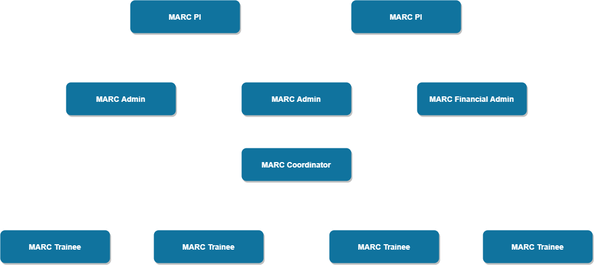

```{r setup, include=FALSE}
knitr::opts_chunk$set(echo = TRUE)
```

### Welcome and Overview

Congratulations on your placement in a summer undergraduate research experience! With this placement comes an incredible opportunity to advance professionally, academically, and personally. Over the course of this experience you will be required to carefully plan and dynamically communicate with your mentor and the MARC program.

This finding research guide will help you with the important steps of becoming a researcher and begin to construct a scholastic framework for the research you will be conducting during the MARC program. You are responsible for creating clear lines of communication with your mentor to ask for their support in guiding you through this placement. You are also responsible for communicating with the MARC program about any difficulties you are experiencing within this process. MARC coordinators will assist you and provide feedback where we can. If you have any questions revisit this guide over the course of the summer research experience.

#### Part 1: Before you start

**This part of the finding your research guide should be completed as soon as possible to ensure your safety ** If it is not possible to complete these sections or you have any questions during your laboratory search, you should fill out as much of this guide as possible and finish the other elements as more information becomes available.

#### Logistical Considerations 

**1. Time Commitment**
When will you start your search? What is your rough goal to find a lab? How many hours will you work towards this effort on the average?

**2. Location and Travel**
Where will you be geographically? How will you participate in your summer research experience? Who will you contact for work?

**3. Living Environment**
Where will you live? Will you be living with anyone? Will you commute or need other resources to search fully? What items will you need to accomplish your search goals?

**4. Working Environment**
What will be the physical conditions and daily activities for your search? Will you be in your house, dormatory, office space? What tasks will you conduct?

#### Organization Description

Before you begin your placement, it is important to identify the key components that guide and structure any lab or organization, and understand your role within the project and the team you will be working with

#### Organizational Structure

Who are the key members of the MARC program? Create and organizational chart to diagram the chain-of-command for the MARC program in the space below. **Include yourself in the diagram**

Organizational charts, like this example, help you to understand the heirarchy of an organization and your specific role. The boxes highlight key personnel and arrows indicate who reports to whom. Create your own organizational charts in the boxes below. Draw.io works wonders when making charts. **Add more boxes if necessary**



#### Part 2: The First Two Weeks

#### Identifying a Lab

Identifying and finding a lab can be a difficult and strenuous process. To find the right fit for you and your goals can be a difficult task. Through using this guide we seek to give you agency, information, and the power to make a decision about which labs you would like to join. There may be questions that you have about this process that are not covered here. Please feel free to contact your coordinator at any time

**1. Your research interests**
List the topics and areas that interest you most. Think about the topics in courses that you found particularly engaging. What inspired you? What pushed you to question? what engaged you?

**2. URI resources**
What are the resources URI or MARC provides that you can use? Where are they? How will you access them? Do they give you all the information you need

**3. Lab Websites**
Navigate to a few of lab websites. Who is the PI? How will you contact them? Who are other people in the lab? Could you contact those people? 

**4. Narrow down your pool of labs**
Name 4-5 labs that you found interesting. You will be using this list in the next section.

#### Background Literature

Review three pieces of literature (minimum) of 2 labs that relate to the research project and summarize each (150 word minimum per summary) with full, proper citations. Use this activity as an opportunity to think critically about the context and implications of the labs research, and to help assess your understanding of their work. 

#### Suggested Approach

Work to identify the critical sections of the literature and focus your reading toward a specific purpose. It is often difficult to understand technical processes or descriptions in literature the first time around. While reading, take notes of what is confusing, what seems important, and what might be important to read more about elsewhere. After performing the initial read and note-taking, take time to consider the most relevant points of the article.

#### Research Description

This is the core of your Lab Search Guide. Using the prompting questions/statements below, develop your ideas of what work the lab is doing. These sections will be improved with time and, eventually, will be used to develop your outreach to these labs.

**1. Research Question**
What problem is this research addressing?

**2. Why is research worth doing?**
Why is this research important?

**3. Proposed Methodology (limit 150 words)**
What would you do? What activities do you see yourself doing? What skills could this research position develop?

#### Personal Learning Goals

In addition to gaining research experience during your placement, you will develop Personal Learning Goals that state what you would like to achieve as a result of your summer experience.

First, think about the following:
* Topics or big ideas from the discipline you would like to understand (e.g., theories, perspectives, broad themes).
* Specific information you want to gain, along with the knowledge about when to apply it to complete specific tasks (e.g., facts, equations, other kinds of core knowledge). 
* Skills you would like to acquire (e.g., methods in your field, problem-solving, critical thinking, independence, time-management, writing or other communication skills)

Now, take your ideas and use them to answer the following questions to create at least five goals for yourself. As you refine your goals, use strong action verbs that describe mastery of the outcome. For example, instead of saying “to learn about…” or “to participate in…” or “to study...” use strong action verbs such as “analyze”, “assess”, “evaluate”, etc. (see Table 1).

| Table 1:Action Verbs for Outcome Statements     |
|------------|-------------|----------------------|
| Analyze    | Apply       | Assess               |
| Build      | Categorize  | Compile              |
| Conduct    | Create      | Demonstrate          |
| Develop    | Establish   | Estimate             |
| Experiment | Evaluate    | Identify             |
| Operate    | Plan        | Report               |
| Research   | Summarize   | Survey               |
| Test       | Translate   | Update               |   

1. What do you want to achieve or be able to do?
    
2. How will you achieve these goals? What activities will you engage in during your search to accomplish this outcome?

3. What products will you produce to demostrate that you have accomplished your outcome?

4. What standards will be used to judge the quality of your products?

#### Part 3: Finding a Lab Timeline

A detailed timeline is essential to the success of your placement. It allows you to identify the sequence of steps you will execute in order to successfully find a good lab that you will be engaged in. Work with you mentor to develop a timeline that shows what you should be working on at each stage of the summer from the beginning to the end of this time period.

Your mentor may assign additional tasks, milestones or deliverables that are not listed as activities or products in your learning outcomes. A task is simply an activity within the project that has a beginning and an end, such as “Document project requirements” or “Contact outside researchers.” A milestone simply indicates that a key part of the project is complete or is about to begin, such as “training completed” or “first prototype ready for testing". A deliverable is any product that your mentor wishes for you to submit to them by a given due date.

Your timeline will consist of activities and products from your learning outcomes, as well as any additional tasks, milestones, or deliverables assigned by your mentor. At a minimum, your timeline should:

* List the activities you will engage in, their approximate duration, and the order that they must be carried out to achieve your learning outcomes.

* List the major products and their associated deadlines. For example, if you’re told to give a presentation on July 20, that should appear as a product in your timeline.

**Contingency Plan**

It is almost certain that some aspects of your search will not go as planned (e.g. shutdown due to COVID-19, scheduling conflicts, personal emergencies, etc.), which may alter your schedule for completing activities and learning outcomes on your project. Consider working with your mentor to develop a contingency plan, which lists resonably likely problems that could arise and brainstorm strategies for detailing with each of those problems if they do arise

| Timeline               | Major Activites, Tasks, Milestones          |
|------------------------|---------------------------------------------|
| Week 1 Date:           |                                             |
| Week 2 Date:           |                                             |
| Week 3 Date:           |                                             |
| Week 4 Date:           |                                             |
| Week 5 Date:           |                                             |
| Week 6 Date:           |                                             |
| Week 7 Date:           |                                             |
| Week 8 Date:           |                                             |
| Week 9 Date:           |                                             |
| Week 10 Date:          |                                             |
| Week 11 Date:          |                                             |

#### Reaching out to a lab

Now is the time to craft an email and decide how you are going to introduce yourself to the lab. There are many ways to go about this. It is important that you do so respectfully, so being thoughtful about how to approach this introduction is crucial. **Remember you are an assest to their lab**. You will need training but when you are accepted you will impact the way work is accomplished in the lab. Also, as a MARC student you will bring the experiences of an underrepresented minority to their community. This is also an assest for not only yourself but for the larger URI research community as a whole. 

**Your Purpose**

In your first paragraph you want to establish who you are and why you are writing. Introduce yourself, and then grab the reader with the “why”.

* Give your name, and pertinent academic details (e.g. “I am an undergraduate at University of Rhode Island majoring in X).

* Explicitly state what you want (e.g. “I am writing to ask if you will accept undedrgraduate students in the coming year for research”).

* Briefly foreshadow your motivation, credibility, and ideas for research. You will follow with the details, so keep this to a short 2-3 sentence summary that bridges to the rest of your statement.

**Your Motivation**

Next, establish why you are seeking graduate opportunities with this individual or degree program. The information in this section should be tailored to your reasons for contacting this individual, it is NOT an opportunity to ramble about your life story or how you are still figuring out what you want to do.

* What motivates you to want to work with this researcher?

* What do you want to get out of this experience?

* What are your general goals and how will this help you to attain them?
    
**Your Credibility**

Talk about what you bring to the table, and explain how you are prepared to conduct research. This can also include professional connections and support that you have that validates your credibility.

* What previous experiences have prepared you to successfully complete the program or research you propose to conduct?

* What skills or new perspectives do you possess that will benefit the researcher or program?

* Name faculty or researchers with whom you have working experience that know the recipient personally (although be careful – only include names if you are OK with the recipient giving the people you name a call to inquire about you).

* Mention any additional support (e.g. MARC, fellowships, scholarships) that you have been awarded or that you will be applying to.
    
**Your Interests and Ideas**

After you have established your motivation and credibility, talk about the specifics of what you want to do and what you expect. 

* Describe your research interests as specifically as possible. Focus on your interests as they relate to the individual or program to which you are writing.

* If you have specific research ideas, propose your research question(s) and how you hope to accomplish them.

* Be specific and provide evidence of due diligence. Through your writing it must be obvious that you are intimately familiar with your discipline and the reader’s work.

* Lay out what role you envision the recipient playing in your research experience, and explain how your research would add value to their work.
    
**Closing**

Your final paragraph should be a summation of everything you have proposed and a call to action.

* Provide a final message that connects your motivation, credibility, and interests. This needs to be succinct and strongly messaged.

* Include a call to action. Request an interview or opportunity to speak with them over the phone. Make it clear that you expect a response.

* Provide contact information so that they may respond to your request.

#### You are well on your way to finding a lab placement. We look forward to hearing how this process is going and what you will accomplish. If you have any questions please feel free to ask any MARC coordinators at anytime
