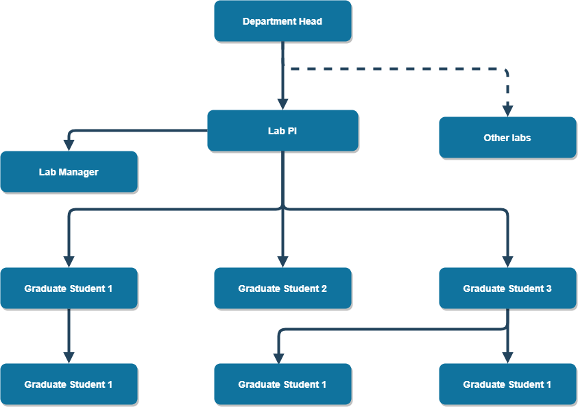

```{r setup, include=FALSE}
knitr::opts_chunk$set(echo = TRUE)
```

### Welcome and Overview

Congratulations on your placement in a summer undergraduate research experience! With this placement comes an incredible opportunity to advance professionally, academically, and personally. Over the course of this experience you will be required to carefully plan and dynamically communicate with your mentor and the MARC program.

This research planning guide will help guide you with the important steps of becoming a researcher and begin to construct a scholastic framework for the research you will be conducting during this summer research placement. You are responsible for creating clear lines of communication with your mentor to ask for their support in guiding you through this placement. You are also responsible for communicating with the MARC program about any difficukties you are experiencing within this process. MARC coordinators will assist you and provide feedback where we can. If you have any questions revisit this guide over the course of the summer research experience.

#### Part 1: Before you start

**This part of the research planning guide should be completed prior to the start of your research placement to ensure your safety and the safety of you research cohort.** If it is not possible to complete these sections or you have any questions prior to the start of your research placement, you should fill out as much of this guide as possible and finish the other elements as more information becomes available.

#### Logistical Considerations 

**1. Time Commitment**
When will you start your research? How many weeks is your placement? How many hours will you work per week on the average?

**2. Location and Travel**
Where will you be geographically? How will you participate in your placement? Who will you contact for work?

**3. Living Environment**
Where will you live? Will you be living with anyone? Will you commute and how? What items will you need to accomplish your research goals?

**4. Working Environment**
What will be the physical conditions and daily activities for your research? Will you be in an office, a laboratory, or in the field? What tasks will you conduct? What is the lab attire?

#### Organization Description

Before you begin your placement, it is important to identify the key components that guide and structure any lab or organization, and understand your role within the project and the team you will be working with>

#### Organizational Structure

Who are the key members of the lab or organization? Create and organizational chart to diagram the chain-of-command for your research group in the space below. **Include yourself in the diagram**

Organizational charts, like this example, help you to understand the heirarchy of an organization and your specific role. The boxes highlight key personnel and arrows indicate who reports to whom. Create your own organizational charts in the boxes below. Draw.io works wonders when making charts. **Add more boxes if necessary**



#### Research Ethics and Permitting

Researchers must consider ethical and legal issues related to their research, and proper review and approval of research protocols ensures that ethical and compliance standards are met. Research that includes human subjects or uses data with identifiable personal information may require Institutional Review Board (IRB) approval, while research conducted on animal subjects may require Institutional Animal Care and Use Committee (IACUC) approval. Each university or research institution will have an IRB and IACUC. Additional permits may be required for research on public lands; access to restricted locations; or collecting, handling, and transporting human, animal, or plant specimens, tissues or pathogens. Students conducting summer research typically work under approvals or permits held by their research mentor or PI.

It is your responsibility to ensure that the research you are conducting has been properly reviewed and that you are familiar with necessary approvals and permits. **Meet with your research mentor to discuss ethical or legal issues pertaining to your research, and the approvals, permits, and training that your research requires.**

[] My research does not require IRB or IACUC review (if you are not sure, review the links below).

[] My research requires IRB or IACUC review, and I am seeking approval. Approval is required prior to beginning research activities. Record contact information for the IRB/IACUC representative familiar with your protocol below.

Name: Phone: Email:
Protocol Name or Number:

Human Subjects Review: Students using human subjects or personal data should consult with their mentor and the URI Division of Research and Economic Development for the Human Subjects Protections Overview. Information about the approval process is available at: <https://web.uri.edu/research-admin/office-of-research-integrity/human-subjects-protections/>

Animal Welfare Review: Applications for IACUC approval must be submitted by a researcher or faculty member at the institution where the research is to be conducted, so students should consult with their mentor. Information about the URI IACUC approval process is available at: <https://web.uri.edu/research-admin/office-of-research-integrity/>

[] My research requires IRB or IACUC review, and has been previously approved (mark this option if you will be working under a research mentor’s approved protocol). Attach a copy of the approval letter. 
Institution: Principle Investigator:
Protocol name or number: 

#### Part 2: The First Two Weeks

#### Background Literature

Review three pieces of literature (minimum) of your Mentor’s choosing that relate to the research project and summarize each (150 word minimum per summary) with full, proper citations. Use this activity as an opportunity to think critically about the context and implications of the research, and to help assess your understanding of the project. 

#### Suggested Approach

Work with your mentor to identify the critical sections of the literature and focus your reading toward a specific purpose. It is often difficult to understand technical processes or descriptions in literature the first time around. While reading, take notes of what is confusing, what seems important, and what might be important to read more about elsewhere. After performing the initial read and note-taking, take time to consider the most relevant points of the article.

#### Research Description
This is the core of your Research Planning Guide. Using the prompting questions/statements below, develop your Research Question, Rationale for the Research, and Proposed Methodology. These sections will be improved with time and, eventually, will be used to develop your abstract, research posters, and reports.

**1. Research Question**
What problem is this research addressing?

**2. Why is research worth doing?**
Why is this research important?

**3. Proposed Methodology (limit 150 words)**
What will you do? How will you collect the data or evidence? How will you analyze the data or evidence?

#### Personal Learning Goals

In addition to gaining research experience during your placement, you will develop Personal Learning Goals that state what you would like to achieve as a result of your research experience. Work with your mentor to develop learning goals that align with the goals of the research project.

First, think about the following:
* Topics or big ideas from the discipline you would like to understand (e.g., theories, perspectives, broad themes).
* Specific information you want to gain, along with the knowledge about when to apply it to complete specific tasks (e.g., facts, equations, other kinds of core knowledge). 
* Skills you would like to acquire (e.g., methods in your field, problem-solving, critical thinking, independence, time-management, writing or other communication skills)

Now, take your ideas and use them to answer the following questions to create at least five goals for yourself. As you refine your goals, use strong action verbs that describe mastery of the outcome. For example, instead of saying “to learn about…” or “to participate in…” or “to study...” use strong action verbs such as “analyze”, “assess”, “evaluate”, etc. (see Table 1).

| Table 1: Action Verbs for Outcome Statements |
|------------|-------------|-------------------|
| Analyze    | Apple       | Assess            |
| Build      | Categorize  | Compile           |
| Conduct    | Create      | Demonstrate       |
| Develop    | Establish   | Estimate          |
| Experiment | Evaluate    | Identify          |
| Operate    | Plan        | Report            |
| Research   | Summarize   | Survey            |
| Test       | Translate   | Update            | 

1. What do you want to achieve or be able to do, as a result of your placement?
    
2. How will you achieve these goals? What activities will you engage in during your placement to accomplish the outcome?

3. What products will you produce to demostrate that you have accomplished your outcome?

4. What standards will be used to judge the quality of your products?

#### Health and Safety

Research can involve physical (e.g. hazardous field conditions, exposure to chemicals, repetitive stress from computer use), and psychological (e.g. working with at-risk populations, stress from odd work hours) hazards.)

**It is critical that you and your mentor discuss the potential health and safety risks that you may encounter, and how to minimize and respond to these risks before you start your research.**

1. Identify and describe specific potential hazards stemming from your research and resources available for you to address them (e.g. safety equipment, training, counseling).

2. Who will you report to in a lab safety emergency?

3. What are the specfic resources in your lab that are important for lab safety

#### Research Funding Sources

The funding used to pay for personnel, equipment, supplies, office and laboratory space, travel, subject reimbursement, and other costs likely comes from funding sources that your mentor, PI, or research institution was awarded through a competitive proposal submission process. You should be familiar with the funding sources that support your work. Meet with your research mentor to **discuss sources of funding, material, equipment, or infrastructure for your research, and appropriate methods for acknowledging this support** in posters, papers, and presentations. Record details for your sources of support in the table below. If available, also request to review research proposals used to secure major funding. We recommend adding the research proposals to your literature review.

| Source (incl. organization and grant/contract #) | Type of Support (grant, funding, lab space) |
|--------------------------------------------------|---------------------------------------------|
|                                                  |                                             |
|                                                  |                                             |
|                                                  |                                             |
|                                                  |                                             |
|                                                  |                                             |

#### Part3:Research Project Timeline

A detailed timeline is essential to the success of your research. It allows you to identify the sequence of steps you will execute in order to successfully complete the project. Work with you mentor to develop a timeline that shows what you should be working on at each stage of the research from the beginning to the end of your placement.

Your mentor may assign additional tasks, milestones or deliverables that are not listed as activities or products in your learning outcomes. A task is simply an activity within the project that has a beginning and an end, such as “Document project requirements” or “Contact outside researchers.” A milestone simply indicates that a key part of the project is complete or is about to begin, such as “training completed” or “first prototype ready for testing". A deliverable is any product that your mentor wishes for you to submit to them by a given due date.

Your timeline will consist of activities and products from your learning outcomes, as well as any additional tasks, milestones, or deliverables assigned by your mentor. At a minimum, your timeline should:

* List the activities you will engage in, their approximate duration, and the order that they must be carried out to achieve your learning outcomes.

* List the major products and their associated deadlines. For example, if you’re told to give a presentation on July 20, that should appear as a product in your timeline.

**Contingency Plan**

It is almost certain that some aspects of your project will not go as planned (e.g. shutdown due to COVID-19, equipment malfunction, scheduling conflicts, personal emergencies, etc.), which may alter your schedule for completing activities and learning outcomes on your project. Consider working with your mentor to develop a contingency plan, which lists resonably likely problems that could arise and brainstorm strategies for detailing with each of those problems if they do arise

| Timeline               | Major Activites, Tasks, Milestones          |
|----------------------------------------------------------------------|
| Week 1 Date:           |                                             |
| Week 2 Date:           |                                             |
| Week 3 Date:           |                                             |
| Week 4 Date:           |                                             |
| Week 5 Date:           |                                             |
| Week 6 Date:           |                                             |
| Week 7 Date:           |                                             |
| Week 8 Date:           |                                             |
| Week 9 Date:           |                                             |
| Week 10 Date:          |                                             |
| Week 11 Date:          |                                             |
| Week 12 Date:          |                                             |
| Week 13 Date:          |                                             |

